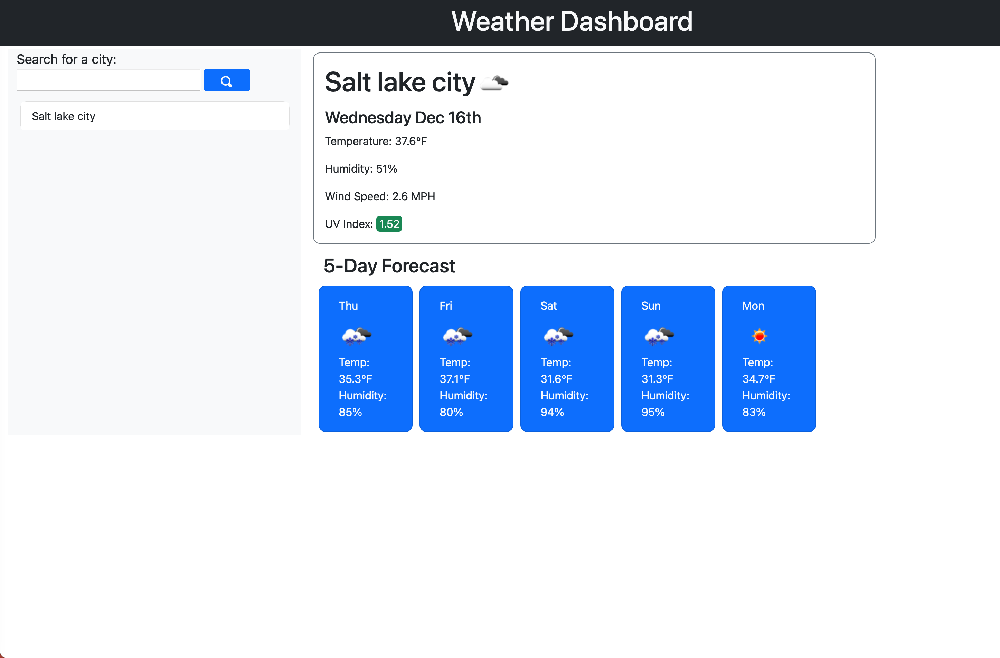

# weather-app
## Purpose: 
*Create a webpage where you can enter a location and get accurate weather information.

##Built With:
*HTML
*CSS
*JavaScript

##Webpage
[Weather App](https://zackaryanderson.github.io/weather-app/)

## Screenshot

